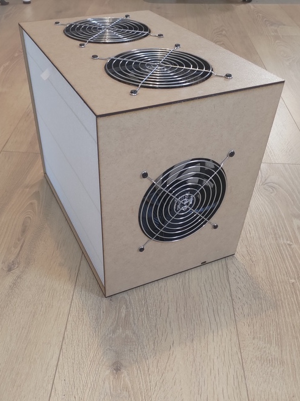
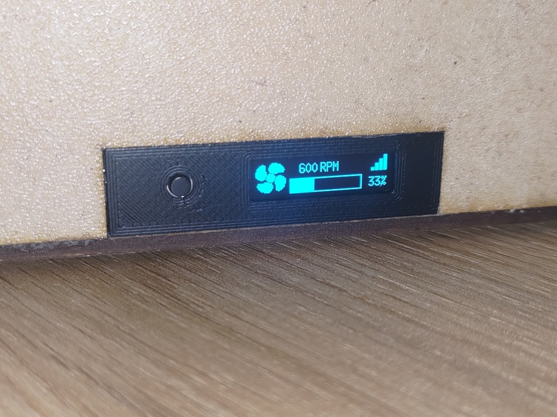
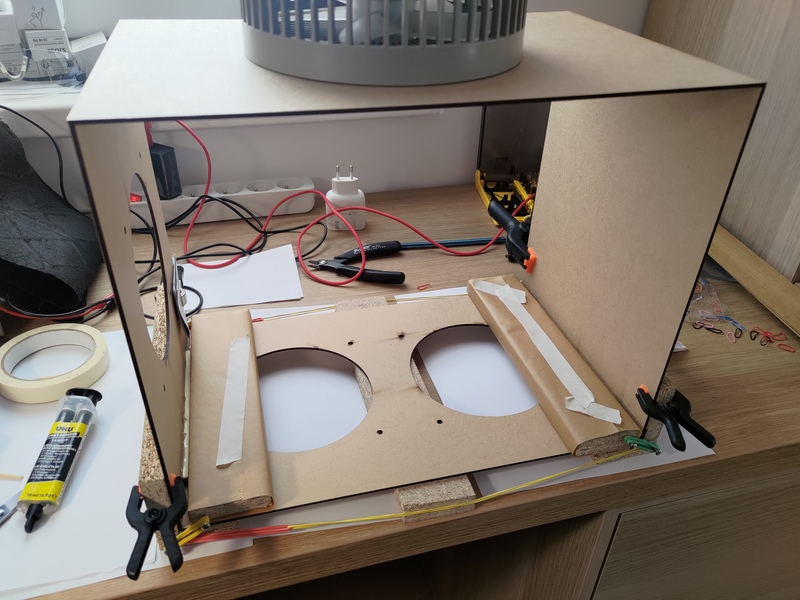
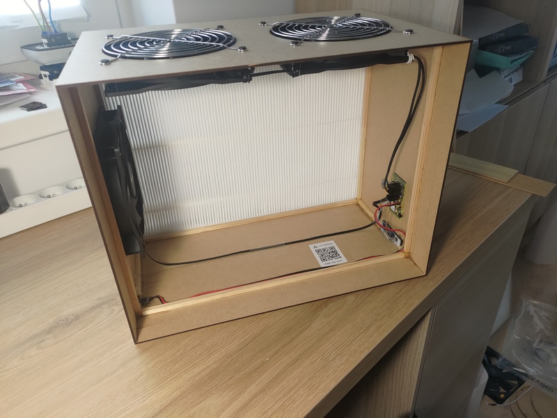
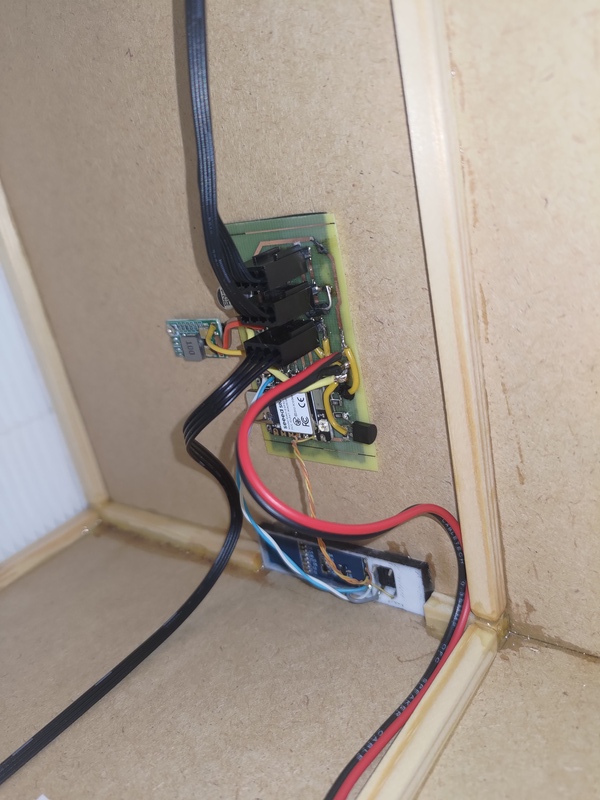

# Matter Air Purifier

Firmware for a CRBox air purifier built around the Seeed Studio XIAO ESP32C6. Controllable via **Matter over Thread**. Integrates well and can be commissioned in Home Assistant. Since the device is not certified, commissioning with other platforms such as Apple Home and Google Home likely does not work directly.

> For an experimental version without Matter that hosts a local web server with a web UI, see the [standalone-mode](../../tree/standalone-mode) branch.

## Hardware

<a href="hardware/Pictures/P_20260402_160100.jpg"></a>
<a href="hardware/Pictures/P_20260402_152525.jpg"></a>

The CRBox is designed for 2 IKEA STARKVIND filters. It has 3 **140mm BeQuiet Pure Wings 3 High Speed** fans which offer extremely quiet operation at low speeds.
The case is made from laser-cut MDF and smoothed 7mm pine strips, glued with epoxy. A small 3D printed part is used as a front panel. It's powered though USB C. It requires a 12V capable USB-PD power supply (IKEA 20W SJÖSS works great).

## Performance


Limited testing shows the Air Purifier can bring an extremely polluted room from ~400 ug/m3 PM2.5 to <10 ug/m3
- in 4 hours at 12% speed.
- in 53 minutes at 50% speed.
- in 17 minutes at 100% speed.

## Making your own
<a href="hardware/Pictures/P_20260328_112051.jpg"></a>
<a href="hardware/Pictures/P_20260402_152141.jpg"></a>
<a href="hardware/Pictures/P_20260402_152229.jpg"></a>

This is a hobby project. I'm sharing this to serve as inspiration for anyone that wants to build something similar. Assembly is quite involved and I'm not providing step by step instructions but I'm sharing all the relevant files. See [hardware](hardware/)

## Features

- **Matter Air Purifier device type** — Fan Control cluster with Off/Low/Medium/High modes and 0–100% speed control
- **3-fan control** — PWM speed control (25 kHz) with per-fan RPM tachometer feedback
- **OLED display** — 128×32 screen showing fan speed, RPM, signal bars, QR code for commissioning, and info/reset screens
- **Physical buttons** — Short press toggles Off/Low/Medium/High; 2 second long press shows info screen. 8 second long press triggers factory reset.
- **Thread-only** — Runs on the ESP32-C6's 802.15.4 radio; WiFi disabled (see [Enabling WiFi](#enabling-wifi-alongside-thread))
- **OTA updates** — Firmware updates via Home Assistant Matter Server
- **Factory NVS partition** — Stores per-device commissioning codes, QR codes

## Commissioning

Use the scripts in `mfg-tool-scripts/` to generate and flash per-device commissioning data:

```bash
./0_clean.sh      # remove previous outputs
./1_generate.sh   # generate new commissioning data
./2_add_qrcode.sh # embed QR and manual pairing codes
./3_flash.sh      # flash to device (default port: /dev/ttyACM0)
```

Override the port: `PORT=/dev/ttyUSB0 ./3_flash.sh`.

Commissioning QR code and manual code will be shown on the tiny screen when the commissioning window is open, but it will be hard to scan. A png of the QR code can be found in `mfg-tool-scripts/out/fff1_8002/<hash>/<hash>-qrcode.png`

## OTA Update via Home Assistant Matter Server

1. Bump `CONFIG_DEVICE_SOFTWARE_VERSION` / `CONFIG_DEVICE_SOFTWARE_VERSION_NUMBER` in `sdkconfig.defaults.esp32c6`
2. Bump `PROJECT_VER` / `PROJECT_VER_NUMBER` in `CMakeLists.txt`
3. Build and compute the OTA checksum:
   ```bash
   openssl dgst -sha256 -binary matter-air-purifier-ota.bin | base64
   ```
4. Copy `matter-air-purifier-ota.bin` to:
   `/addon_configs/core_matter_server/updates/matter-air-purifier-ota.ota`
5. Create `matter-air-purifier-ota.json`:
   ```json
   {
     "modelVersion": {
       "vid": 65521,
       "pid": 32769,
       "softwareVersion": <VERSION>,
       "softwareVersionString": "<VERSION STRING>",
       "cdVersionNumber": 1,
       "softwareVersionValid": true,
       "otaUrl": "file:///matter-air-purifier-ota.ota",
       "otaChecksum": "<CHECKSUM>",
       "otaChecksumType": 1,
       "minApplicableSoftwareVersion": 0,
       "maxApplicableSoftwareVersion": <PREVIOUS VERSION>,
       "releaseNotesUrl": ""
     }
   }
   ```
6. Trigger the update from the Matter Server web UI by selecting the node in the sidebar.

## Enabling WiFi alongside Thread

The ESP32-C6 has separate radios for 802.15.4 (Thread) and WiFi, so both can run simultaneously. WiFi is disabled by default because it increases RAM/flash usage and the WiFi radio stays powered even when idle (no credentials commissioned).

To enable WiFi as a secondary network interface:

1. In `sdkconfig.defaults.esp32c6`, change:
   ```
   CONFIG_ENABLE_WIFI_STATION=n
   ```
   to:
   ```
   CONFIG_ENABLE_WIFI_STATION=y
   ```

2. Switch mDNS to the platform implementation (required for Thread DNS-SD):
   ```
   CONFIG_USE_MINIMAL_MDNS=n
   ```
   > **Note:** The platform mDNS backend (`ESP32DnssdImpl.cpp`) currently has build errors (ignored `CHIP_ERROR` returns treated as fatal by `-Werror`). If the build fails, set `CONFIG_USE_MINIMAL_MDNS=y` as a workaround until the upstream SDK is fixed.

3. Rebuild and reflash.

## AI Disclaimer
This project was coded with heavy use of Claude Code